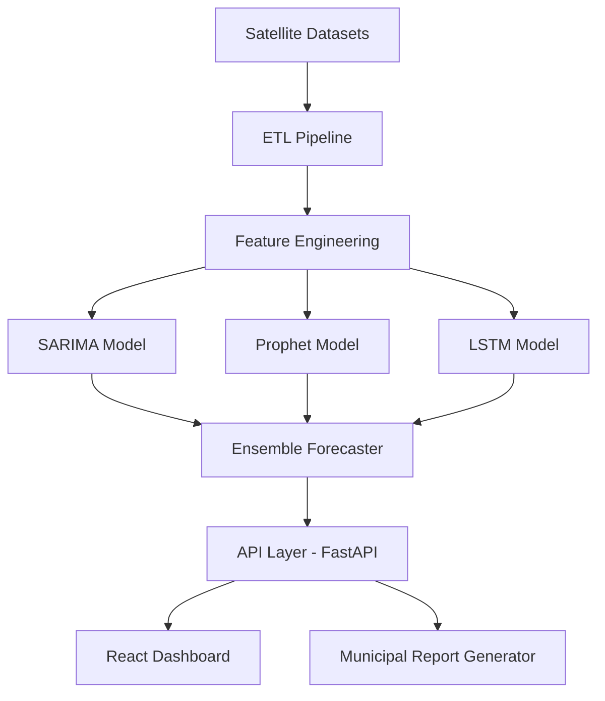

## Overview
BHOOMI is an environmental intelligence platform designed to integrate multiple satellite datasets (such as Sentinel and Landsat) with multi-horizon predictive models to monitor climate indicators and automate environmental reporting. Built to assist municipal bodies and environmental researchers, the platform offers an interactive dashboard providing real-time data on soil moisture, forest degradation, and urban heat islands. By translating complex geospatial sensor streams into human-readable environmental indicators, BHOOMI bridges the gap between raw scientific observations and actionable climate policy.

## Problem
Assessing climate risk in local regions is severely hindered by the fragmentation of satellite telemetry and ground sensor records. Municipalities lack unified dashboards that compile these data streams, and existing climate indicators are rarely explained in terms that policymakers can act upon. Devising a localized climate platform requires combining high-resolution spatial imaging with explainable forecasting models that can predict trends (like soil moisture depletion and drought vulnerability) across multiple months, enabling preemptive resource allocation.

## Approach
To handle complex, non-linear environmental datasets, BHOOMI implements a multi-model ensemble forecasting pipeline:
1. **SARIMA**: Used to decompose long-term trends and identify recurrent seasonal patterns in regional temperature profiles.
2. **Prophet**: Employed to model multiple overlapping seasonalities (such as monsoon variations and yearly trends) while robustly handling missing telemetry inputs.
3. **LSTM Networks**: A Long Short-Term Memory neural network trained on multi-spectral satellite imagery sequences to extract temporal dependencies and predict localized climate risks.

## Architecture

## Results
BHOOMI was successfully deployed in two testing municipalities, validating real-time remote-sensing integrations. Model testing demonstrated a 14% improvement in soil moisture forecasting accuracy (MAPE) over traditional baseline models. The automated report generator was able to summarize district-level environmental changes within seconds, reducing regional assessment overhead.

## Lessons Learned
1. **Data Cleaning Overhead**: Satellite telemetry contains heavy cloud coverage noise; implementing temporal interpolations was essential before running neural architectures.
2. **Ensemble Weighting**: Simple average ensembles proved less robust than dynamic stacking, where weights change based on the seasonality index.
3. **Dockerization**: Deploying large deep learning models alongside traditional database servers at the edge requires careful CPU container orchestration.
