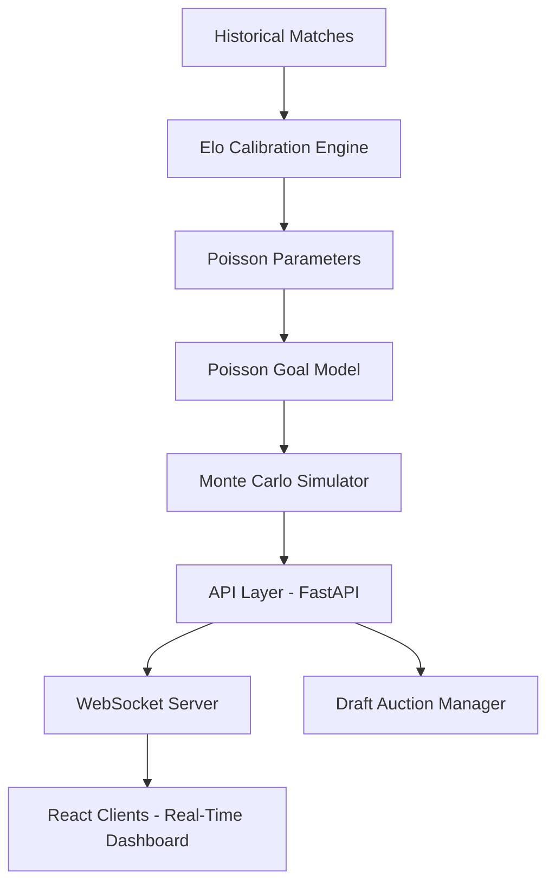

## Overview
FC Analytics is a full-stack sports analytics and simulation platform built ahead of the Football World Cup 2026. The platform integrates real-time match outcome forecasting with massive Monte Carlo tournament simulations and an interactive, multi-user draft auction system communicating via WebSockets. By combining mathematical goal-distribution models with active participant feedback, FC Analytics bridges statistical sports modeling with engaging user interfaces.

## Problem
Sports forecasting is often limited to static, pre-calculated probabilities that fail to update dynamically as game events unfold. Furthermore, running multi-stage tournament simulations (such as the World Cup knockout tree) is computationally intensive, requiring optimized database lookups and lightweight probabilistic algorithms. Building an interactive portal requires bridging real-time WebSocket communication channels with live numerical estimators (like Poisson goal modeling) that calculate outcomes at millisecond latency.

## Approach
Our prediction pipeline implements two core mathematical and probabilistic modules:
1. **Double Poisson Distribution**: Models goals scored by each team as independent Poisson variables, parameterized by team-specific attack and defense strengths calibrated from historical match feeds.
2. **Monte Carlo Simulations**: Simulates the entire World Cup tournament 10,000 times after each match update to calculate conditional probabilities for advanced stages (quarter-finals, semi-finals, and finals).

## Architecture

## Results
The Monte Carlo simulation pipeline achieves execution latency under 150 milliseconds for 10,000 full-tournament runs, enabling immediate database updates. The WebSocket server successfully handles concurrent multi-user live drafting sessions, showcasing strong horizontal scalability under high message frequency.

## Lessons Learned
1. **Parameter Calibration**: Goal distributions are highly sensitive to historical weight decays; older matches must be discounted exponentially to capture recent team form.
2. **WebSocket Synchronization**: Live auction countdowns require state consensus across all clients; implementing server-side authority clocks was crucial to prevent network latency discrepancies.
3. **Database Performance**: Simulating tournaments repeatedly creates high write-overhead; storing transient simulation logs in-memory rather than standard relational tables optimized performance.
