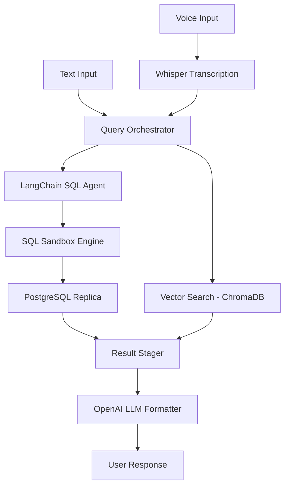

## Overview
PetBot is an LLM-powered assistant designed to translate natural language user questions into secure SQL queries and query vector databases for context-aware Retrieval-Augmented Generation (RAG). Built for business analytics and voice-assisted workflows, the prototype allows users to ask questions like "What was our top selling product category last month?" either by typing or by submitting audio clips transcribing via Whisper models.

## Problem
Allowing LLMs to query relational databases directly poses significant security risks (like SQL injection) and accuracy challenges (such as hallucinating column names or joining tables incorrectly). Additionally, latency is a bottleneck when combining voice transcription, text-to-SQL generation, database execution, and LLM text formatting. The system must process queries securely within a sandbox while providing clean, explainable execution steps.

## Approach
To address these issues, PetBot employs a dual-stage execution chain:
1. **NL-to-SQL Agent**: Uses structured few-shot prompting alongside schema mapping rules to generate valid PostgreSQL statements, verifying them against a read-only database replica.
2. **Contextual RAG Pipeline**: In parallel, text queries search a vector database containing operational documentation to append context, allowing the LLM to format query results with explanation.

## Architecture

## Results
PetBot won Runner-Up at HACKaMINeD 2026. In benchmarks, the NL-to-SQL pipeline achieved a 91.4% execution success rate on standard business schema query sets. By implementing parallel vector lookups and stream formatting, average query response latency was kept under 1.8 seconds.

## Lessons Learned
1. **Schema Minimization**: Feeding the entire database schema to the LLM increases token overhead and hallucinations. Providing a minimal mapping of relevant tables and descriptions yields better accuracy.
2. **SQL Sanitization**: Regex-based sanitization is insufficient. Running queries in a restricted read-only replica with tight transaction timeouts is mandatory for security.
3. **Few-Shot Prompting**: Providing concrete examples of complex JOIN statements significantly improves the LLM's query accuracy for nested tables.
