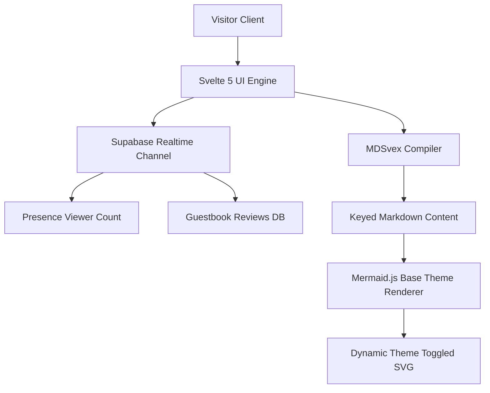

## Overview
This portfolio is an interactive developer, research, and engineering showcase website. It is designed to host project case studies, publication timelines, and live viewer interactions using a premium "academic-sepia" design system. The architecture integrates Svelte 5's reactivity model, Tailwind CSS v4, MDSvex markdown processing, and a serverless Supabase backend for real-time presence and feedback.

## Problem
Modern developer portfolios often require heavy framework resources or fall back to static text templates that feel unresponsive. The challenge was to construct a fast, lightweight, keyboard-navigable portfolio that parses markdown case studies, renders live guestbook comments, tracks real-time concurrent user presence securely, and automatically updates inline architecture diagrams (Mermaid.js flowcharts) to match active light/dark theme variables.

## Approach
To address these requirements, the portfolio utilizes:
1. **Fine-Grained Reactivity**: Leverages Svelte 5 runes (`$state`, `$derived`, `$effect`) for instant client-side state synchronization, including search actions in the Command Palette.
2. **Supabase Realtime Sync**: Subscribes clients to a realtime Presence channel (`landing-page`) to display the live viewer count and user join order, while writing guestbook submissions directly to PostgreSQL database tables with optimistic UI state changes.
3. **Keyed Component Remounting**: Dynamically destroys and re-mounts the compiled markdown templates using a `{#key $theme}` block when the dark-light theme is toggled. This forces client-side Mermaid compilation to run fresh queries of active CSS variables and output highly legible SVGs.

## Architecture

## Results
The portfolio achieves near-instantaneous page transitions and renders dynamic elements with high performance. Toggling light/dark modes triggers immediate CSS overrides at a fast `150ms` rate on mobile screen sizes. The reviews guestbook permits quick anonymous comment routing, and Mermaid flowcharts update instantly to preserve text readability in dark and light modes.

## Lessons Learned
1. **Reactive Re-mounting**: SVG renderers like Mermaid inject styling variables statically into SVG code blocks during generation. Wrapping Svelte markdown components in a theme-based key block guarantees proper theme-switching consistency.
2. **Transition Duration Specificity**: Overriding transitions on all elements using media queries and `transition-duration: 150ms !important` ensures consistent animation speeds on mobile viewports.
3. **Presence Teardown**: Subscribing to Presence states requires proper teardown on unmount to prevent memory leaks and stale connection states.
