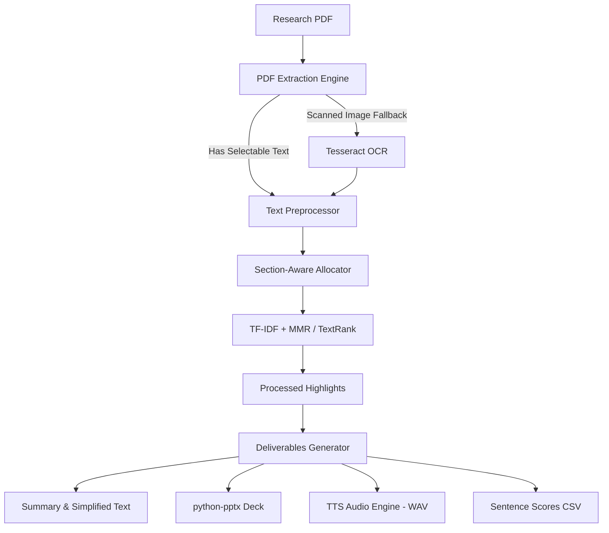

## Overview
Research Assistant is a local-first, offline research paper assistant designed to process scientific publication PDFs and automatically generate structured deliverables. Without requiring external API keys or remote LLM calls, the assistant generates full-paper extractive summaries (section-aware), simplified versions, podcast-style scripts with optional Text-to-Speech (TTS) WAV audio, formatted PowerPoint presentation decks, and video scripts along with evaluation metrics.

## Problem
Processing complex research papers often forces users to rely on cloud-hosted LLM APIs, raising privacy concerns and requiring recurring subscription or token costs. Furthermore, simple text models often produce "abstract-only" summaries by failing to analyze section distributions or mathematical sentence scoring. Building a fully offline, private research assistant requires combining high-fidelity local PDF extraction engines, OCR fallbacks for scanned documents, and computationally efficient extractive summarization algorithms (such as TF-IDF combined with MMR diversity optimization) that execute quickly on consumer hardware.

## Approach
The tool processes papers via a modular, local-first pipeline:
1. **Document Parsing & Extraction**: Reads embedded text pages. If standard text extraction fails, it triggers an OCR fallback using `pdf2image` (Poppler) and `Tesseract OCR` to extract clean text.
2. **Text Preprocessing**: Normalizes inputs by removing hyphenations, stripping out running headers/footers, cleaning citations, and fixing common PDF parsing artifacts.
3. **Section-Aware Summarization**: Computes sentence importance using TF-IDF and Maximal Marginal Relevance (MMR) or TextRank. It applies a section-aware allocation algorithm to guarantee that sections like methodology and results are represented, preventing the summary from being dominated solely by the abstract.
4. **Deliverable Generation**: Formats the extracted highlights into simplified summaries, writes structured podcast scripts, converts them to audio via offline Text-to-Speech, creates a structured `.pptx` deck via `python-pptx`, and outputs sentence scoring logs and metadata.

## Architecture

## Results
The offline research assistant runs entirely locally, ensuring complete data privacy for proprietary papers and drafts. By using lightweight statistical scoring (TF-IDF + MMR) instead of neural network inference, full paper analysis and deck generation are completed within seconds, rather than minutes. The section-aware allocator ensures comprehensive summarization of the methodology and discussion, improving key detail coverage compared to standard top-n sentence selectors.

## Lessons Learned
1. **OCR Dependencies on Windows**: Implementing OCR fallbacks requires external system binaries (`Tesseract` and `Poppler`). Providing fallback alerts is essential for smooth user experiences when dependencies are missing.
2. **Audio Post-Processing**: Direct Text-to-Speech outputs can have uneven pacing. Leveraging `pydub` and `FFmpeg` to stitch segments and adjust silences significantly enhances the listenability of the podcast-style audio.
3. **Preventing Abstract Bias**: Standard extractive summaries are heavily biased toward the abstract and introduction. Forcing a stratified sampling across sections guarantees that critical findings in results and methodologies are captured.
